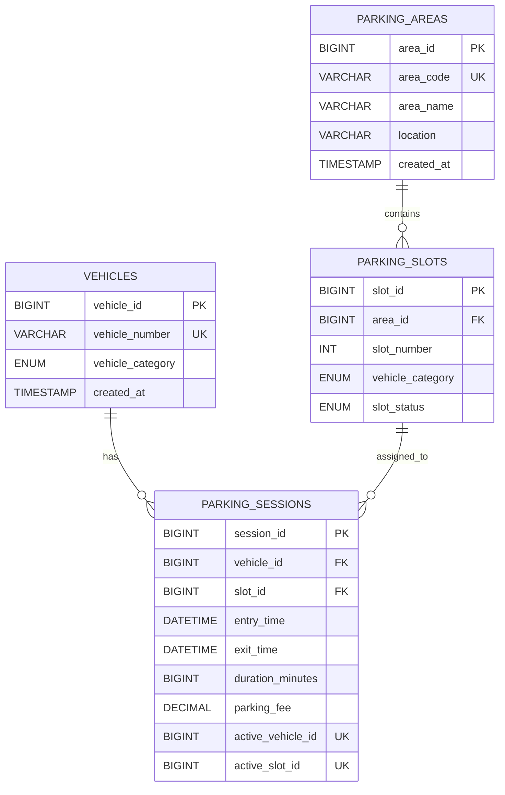

# Smart Parking Slot Allocator — ER Diagram

```mermaid
erDiagram
    PARKING_AREAS {
        BIGINT area_id PK
        VARCHAR area_code UK
        VARCHAR area_name
        VARCHAR location
        TIMESTAMP created_at
    }

    PARKING_SLOTS {
        BIGINT slot_id PK
        BIGINT area_id FK
        INT slot_number
        ENUM vehicle_category
        ENUM slot_status
    }

    VEHICLES {
        BIGINT vehicle_id PK
        VARCHAR vehicle_number UK
        ENUM vehicle_category
        TIMESTAMP created_at
    }

    PARKING_SESSIONS {
        BIGINT session_id PK
        BIGINT vehicle_id FK
        BIGINT slot_id FK
        DATETIME entry_time
        DATETIME exit_time
        BIGINT duration_minutes
        DECIMAL parking_fee
        BIGINT active_vehicle_id UK
        BIGINT active_slot_id UK
    }

    PARKING_AREAS ||--o{ PARKING_SLOTS : contains
    VEHICLES ||--o{ PARKING_SESSIONS : has
    PARKING_SLOTS ||--o{ PARKING_SESSIONS : assigned_to
```
