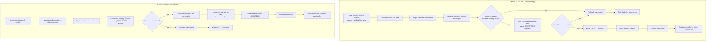

# Smart Parking Slot Allocator — Vehicle Entry and Exit Workflow

```mermaid
flowchart TB
    subgraph ENTRY["VEHICLE ENTRY — recordEntry()"]
        A["User submits vehicle number,<br/>category and parking area"]
        B["Validate vehicle and area"]
        C["Begin database transaction"]
        D["Register vehicle or retrieve existing ID"]
        E{"Vehicle category<br/>matches existing record?"}
        F["Find compatible available slot<br/>using SELECT FOR UPDATE"]
        G{"Suitable slot available?"}
        H["Mark slot as OCCUPIED"]
        I["Insert parking session"]
        J["Commit transaction"]
        K["Entry successful — return session ID"]
        L["Rollback transaction"]
        M["Entry failed — show error"]

        A --> B --> C --> D --> E
        E -- No --> L
        E -- Yes --> F --> G
        G -- No --> L
        G -- Yes --> H --> I --> J --> K
        L --> M
    end

    subgraph EXIT["VEHICLE EXIT — recordExit()"]
        N["User submits vehicle number"]
        O["Validate and normalize vehicle number"]
        P["Begin database transaction"]
        Q["Find active parking session<br/>using SELECT FOR UPDATE"]
        R{"Active session found?"}
        S["Calculate duration and parking fee"]
        T["Update session with exit time,<br/>duration and fee"]
        U["Mark parking slot as AVAILABLE"]
        V["Commit transaction"]
        W["Exit successful — return parking fee"]
        X["Rollback transaction"]
        Y["Exit failed — show error"]

        N --> O --> P --> Q --> R
        R -- No --> X
        R -- Yes --> S --> T --> U --> V --> W
        X --> Y
    end
```
